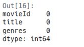

# Laporan Proyek Machine Learning - Refanda Surya Saputra

## Project Overview

Sebagai manusia, kita tidak bisa lepas dengan yang namanya kesibukan. Keadaan yang bisa datang kapan saja dan berasal
dari mana saja, contohnya dari pekerjaan, tugas sekolah/kuliah dan hal-hal lainnya yang dapat membuat stres dan emosi.
Oleh karena itu, perlu untuk istirahat sejenak agar pikiran bisa menjadi lebih tenang. Salah satu solusinya yaitu dengan
menonton film favorit. Era teknologi sekarang ini, selain datang ke bioskop, banyak sekali alternatif yang dapat kita
gunakan untuk menonton film, yaitu melalui smartphone kesayangan kita dengan menggunakan aplikasi seperti Youtube,
Netflix atau WeTV.

Jika kita adalah pengguna setia aplikasi streaming film seperti Netflix, di menu utama aplikasi, kita akan disuguhkan
dengan rekomendasi film yang ceritanya sesuai dengan yang biasa kita tonton. Jika kita biasanya suka menonton film
komedi, maka di tampilan atas akan terlihat rekomendasi film yang memiliki genre komedi. Hal ini terjadi karena aplikasi
tersebut menerapkan sistem rekomendasi yang menggunakan algoritma atau teknik tertentu untuk memberikan saran film yang
relevan dengan pengguna.

Sistem rekomendasi akan membantu untuk menemukan film yang sesuai dengan preferensi pengguna, meningkatkan pengalaman
menonton dan meningkatkan kepuasan pengguna. Manfaat yang diberikan dengan penerapan sistem rekomendasi ini dapat
membuat perusahaan seperti Netflix untuk meningkatkan jumlah penggunanya. Selain itu, dengan adanya sistem rekomendasi
ini kita juga dapat lebih cepat memilih film yang cocok dengan kita tanpa perlu melakukan pencarian atau scrolling film,
yang mana ini memakan waktu istirahat kita. Jika tidak ada sistem rekomendasi ini, kemungkinan kita tidak akan jadi
istirahat dan justru pusing karena sibuk memilih film yang tepat.

Terdapat berbagai metode untuk menerapkan sistem rekomendasi, di antaranya adalah Content-based Filtering, Collaborative
Filtering, dan Hybrid Filtering. Dari berbagai metode tersebut, proyek ini akan berfokus pada penerapan dua pendekatan,
yaitu Content-based dan Collaborative Filtering. Pendekatan pertama, Content-based Filtering, berfokus pada analisis
atribut atau konten dari item itu sendiri. Sebagaimana ditunjukkan oleh Siagian et al. [1], metode ini terbukti efektif
memberikan rekomendasi berdasarkan deskripsi atau sinopsis film yang pernah disukai pengguna. Di sisi lain, pendekatan
Collaborative Filtering bekerja dengan cara yang berbeda, yaitu memberikan rekomendasi berdasarkan interaksi dan rating
pengguna tanpa perlu menganalisis konten item. Menurut Wiputra dan Shandi [2], metode ini mampu mengelompokkan item dan
pengguna berdasarkan pola rating yang serupa. Kombinasi kedua metode ini memungkinkan sistem untuk memberikan
rekomendasi yang tidak hanya personal, tetapi juga beragam.

**Daftar Referensi**

[1] R. I. P. Siagian, N. Khoiriah, S. A. Priscilia, M. R. A. Tanjung, and A. Perdana, "Penerapan Machine Learning untuk
Rekomendasi Film Berdasarkan Preferensi Pengguna," JATI (Jurnal Mahasiswa Teknik Informatika), vol. 9, no. 4, pp.
5658-5662, 2025.

[2] M. M. Wiputra and Y. J. Shandi, "Perancangan Sistem Rekomendasi Menggunakan Metode Collaborative Filtering dengan
Studi Kasus Perancangan Website Rekomendasi Film," Media Informatika, vol. 20, no. 1, pp. 1-8, 2021.

## Business Understanding

Sistem rekomendasi merupakan teknologi cerdas yang telah menjadi strategi bisnis bagi platform digital, dengan cara
menganalisis data perilaku pengguna dan atribut item untuk menyajikan konten secara personal. Platform-platform
terkemuka memanfaatkan teknologi ini untuk mempertahankan pengguna. Dengan secara proaktif menyajikan film yang relevan,
layanan-layanan ini berhasil menekan tingkat pelanggan yang berhenti berlangganan. Hal ini membuktikan bahwa
implementasi sistem rekomendasi bukanlah sekadar fitur teknis, melainkan sebuah solusi strategis untuk pertumbuhan dan
keberlanjutan bisnis di era digital.

### Problem Statements

- Bagaimana cara menggunakan atribut konten film, khususnya genre, untuk merekomendasikan film lain yang memiliki
  kemiripan dengan film-film yang telah disukai pengguna?
- Bagaimana cara menggunakan data rating dari seluruh pengguna untuk menemukan pengguna lain dengan selera serupa, untuk
  merekomendasikan film yang kemungkinan besar akan disukai?

### Goals

- Menggunakan pendekatan Content-based Filtering untuk menghasilkan rekomendasi film yang memiliki genre yang serupa
- Menggunakan pendekatan Collaborative-Filtering untuk menghasilkan rekomendasi film yang belum pernah ditonton oleh
  pengguna

### Solution Statements

- Membuat sistem rekomendasi film dengan dua pendekatan yaitu Content-based Filtering dan Collaborative Filtering
- Menerapkan regularisasi L2 di lapisan embedding pada pendekatan Collaborative Filtering untuk mencegah overfitting

## Data Understanding

Data yang digunakan pada proyek sistem rekomendasi film ini adalah Movie Lens Small Latest Dataset yang diunduh
dari [Kaggle](https://www.kaggle.com/datasets/shubhammehta21/movie-lens-small-latest-dataset). Dataset ini terdiri dari
empat file yaitu links.csv, movies.csv, tags.csv dan ratings.csv. Dataset ini mengandung 100836 rating dan 3683 tag pada
9742 film yang diberikan oleh pengguna. Data ini dibuat oleh 610 pengguna antara Maret 29, 1996 dan September 24, 2018.

### Variabel-variabel pada Movie Lens Small Latest Dataset adalah sebagai berikut:

- **movies**: ini adalah data film meliputi judul dan genre
- **links**: ini adalah data sumber film yaitu tmd dan imdb
- **tags**: ini adalah data tag pada film yang diberikan oleh pengguna
- **ratings**: ini adalah rating yang diberikan pada pengguna pada film yang sudah ditonton

### Exploratory Data Analysis

Berikut ini adalah beberapa tahapan EDA yang telah dilakukan pada proyek ini.

#### Melihat Informasi Dataset

**Links Dataset**


Berdasarkan informasi di atas, dataset links memiliki 9741 entri. Terdapat tiga variabel pada dataset ini yaitu movieId,
imdbId dan tmdbId.

**Movies Dataset**


Berdasarkan informasi di atas, dataset movies memiliki 7742 entri. Terdapat tiga variabel pada dataset ini yaitu
movieId, title atau judul film dan genres.

**Ratings Dataset**


Berdasarkan informasi di atas, dataset ratings memiliki 100835 entri. Terdapat empat variabel pada dataset ini yaitu
userId, movieId, rating dan timestamp.

**Tags Dataset**


Berdasarkan informasi di atas dataset tags memiliki 3682 entri. Terdapat empat variabel pada dataset ini yaitu userId,
movieId, tag dan timestamp.

#### Mengecek Missing Value

<div style="display:flex; justify-content: space-between; gap: 10px">
 <div style="width: 25%; height: auto; display:flex; flex-direction:column;align-items:center">
  <p style="font-weight: bold">Links</p>
  
 </div>
 <div style="width: 25%; height: auto; display:flex; flex-direction:column;align-items:center">
  <p style="font-weight: bold">Tags</p>
  
 </div>
 <div style="width: 25%; height: auto; display:flex; flex-direction:column;align-items:center">
  <p style="font-weight: bold">Movies</p>
  
 </div>
 <div style="width: 25%; height: auto; display:flex; flex-direction:column;align-items:center">
  <p style="font-weight: bold">Ratings</p>
  
 </div>
</div>

Dari keempat dataset di atas, setelah mengecek menggunakan isna() tidak ditemukan adanya missing value/Nan.

#### Melihat Deskriptif Statistik pada Dataset Ratings


Dari informasi di atas, ditemukan bahwa nilai minimum user memberikan rating adalah 0.5 dan maksimum ratingnya adalah 5.
Ini artinya, skala rating berkisar antara 0.5 hingga 5. Kemudian untuk rata-rata user memberikan rating 3.5.

#### Mengecek Nilai Duplikat pada Dataset


Dari keempat dataset di atas, setelah melakukan pengecekan dengan fungsi duplicated() tidak ditemukan adanya data yang
sama/duplikat.

## Data Preprocessing

Ini adalah tahap persiapan data sebelum digunakan untuk proses selanjutnya yaitu Data Preparation. Pada tahap ini
dilakukan penggabungan beberapa file dataset menjadi satu kesatuan file yang utuh.


Pada gambar di atas adalah contoh beberapa data setelah melakukan merge pada dataset movies dan ratings. Hasil merging
ini untuk kolomnya ada movieId, title, genres, rating dan userId.

- Dari tahap ini dihasilkan dataframe dari hasil gabungan dataset movies dan ratings. main_movies_df akan digunakan
  untuk membuat sistem rekomendasi film.
- Setelah dilakukan merge movies dan ratings, kemudian melakukan pengecekan missing value dengan isna(). Ditemukan untuk
  variabel rating dan userId terdapat missing value dengan jumlah masing-masing adalah 18 data. Masalah ini akan
  ditangani pada tahap Data Preparation.
- Setelah merging tidak ditemukan data duplikasi

## Data Preparation

Berikut ini adalah proses-proses yang dilakukan pada tahap Data Preparation, suapaya data siap digunakan untuk modeling.

### Mengatasi Missing Value

Pada tahap Data Preprocessing dihasilkan dataframe yang masih terdapat missing value. Pada tahap ini dilakukan
penanganan masalah tersebut dengan cara melakukan drop menggunakan fungsi dropna(). Fungsi dropna() akan menghapus baris
data yang mengandung missing value/nan. Proses ini perlu dilakukan untuk menjaga kulaitas dan integritas data, sehingga
analisis dan model yang dibangun menjadi lebih andal.

### Konversi Data Series menjadi List

Setelah menangani missing value, dibuat dataframe main_movies_clean_df. Dari dataframe ini diambil tiga variabel pada
main_movies_clean_df yaitu movieId, title dan genre. Kemudian dari ketiga variabel ini diubah menjadi list. Setelah itu,
membuat dictionary dengan pasangan key:value sesuai dengan variabel yang diambil. Kemudian dibuat dataframe yaitu
movie_new dari dictionary yang sudah dibuat.


Pada gambar di atas adalah hasil dataframe baru dari tahap ini dengan nama movie_new. Dataframe ini digunakan untuk
modeling menggunakan pendekatan Content-based Filtering.

### Melakukan Formatting pada Variabel Genres

Terdapat nilai pada variabel genres yang dipisahkan dengan tanda "-". Untuk memudahkan proses vektorisasi nantinya, maka
perlu mengghapus tanda "-" menjadi tanpa spasi. Berikut ini adalah kodenya.

```python
movies_formatted_df = movie_new.iloc[:]
movies_formatted_df['genres'] = movies_formatted_df['genres'].str.replace('-', '', regex=False)
movies_formatted_df
```

### Menghapus Data dengan Genre Tidak Jelas

Terdapat film dengan genre yang tidak jelas yaitu "(no genres listed)". Untuk menjaga kualitas data, maka perlu
dilakukan penghapusan pada data tersebut. Berikut ini adalah potongan kode untuk proses ini.

```python

fix_movies_df = fix_movies_df.replace('(no genres listed)', np.nan)
fix_movies_df = fix_movies_df.dropna()

fix_movies_df
```

### Melakukan Encoding Fitur userId dan movieId ke dalam Indeks Integer

Tahapan ini digunakan untuk mengubah ID asli (userId dan movieId) yang mungkin tidak berurutan menjadi ID baru yang
berurutan mulai dari 0, 1, 2, dan seterusnya. Dataframe baru dari proses ini digunakan untuk modeling dengan pendekatan
Collaborative Filtering.

### Mempersiapkan Data untuk Modeling Collaborative Filtering

Mempersiapkan data yaitu jumlah user, jumlah film, nilai minimum rating dan nilai maksimu rating. Data ini digunakan
untuk modeling dengan pendekatan Collaborative Filtering.


Dari gambar di atas, didapatkan jumlah user adalah 610, film ada 9724, minimum rating yang diberikan pengguna adalah 0.5
dan maksium adalah 5.

### Membagi Dataset untuk Training dan Validasi

Sebelum melakukan spliting dataset, data diacak terelbih dahulu supaya distribusinya menjadi random. Berikut ini adalah
potongan kodenya.

```python
# Mengacak data
new_rating_df = new_rating_df.sample(frac=1, random_state=42)
new_rating_df
```

Setelah melakukan pengacakan dataset baru dilakukan spliting dataset. Dataset dibagi menjadi data train dan data
validasi dengan perbandingan 80:20. Sebelum melakukan spliting dataset, dilakukan scaling nilai variabel rating dalam
rentang 0 sampai 1 untuk mempermudah proses training. Data train dan validasi ini digunakan untuk modeling dengan
pendekatan Collaborative Filtering. Berikut ini adalah potongan kode untuk melakukan scaling dan spliting data.

```python
# Membuat variabel y untuk membuat rating dari hasil
y = new_rating_df['rating'].apply(lambda z: (z - min_rating) / (max_rating - min_rating)).values

# Membagi menjadi 80% data train dan 20% data validasi
train_indices = int(0.8 * new_rating_df.shape[0])

x_train, x_val, y_train, y_val = (
    x[:train_indices],
    x[train_indices:],
    y[:train_indices],
    y[train_indices:],
)
```

## Modeling

Tahapan ini membahas mengenai model sisten rekomendasi yang dibuat untuk menyelesaikan permasalahan. Pada proyek ini
dilakukan dua pendekatan yaitu Content-based Filtering dan Collaborative Filtering.

### Content-based Filtering

Metode ini merekomendasikan konten yang mirip dengan konten yang disukai pengguna di masa lalu. Similarity diukur dari
atribut dari konten (dalam proyek ini adalah film) itu sendiri. Sebagai contoh, jika pengguna menyukai film Toy Story (
genre: cartoon), sistem rekomendasi akan menyarankan film lain dengan genre yang sama seperti Monster Inc dan Finding
Nemo.

**Kelebihan:**

- Tidak membutuhkan data pengguna lain
- Dapat merekomendasikan konten baru selama konten tersebut memiliki atribut yang jelas tanpa perlu menunggu ada yang
  me-review atau menyukainya tersebih dahulu

**Kekurangan:**

- Kualitas rekomendasi sangat bergantung pada kelengkapan dan kualitas deskripsi dari konten
- Cold Start, jika sistem belum memiliki data riwayat apapun dari pengguna baru, sistem tidak tahu harus
  merekomendasikan konten

**Mendapatkan Rekomendasi Film**

Berikut ini adalah contoh keluaran dari pembuatan sistem rekomendasi menggunakan pendekatan Content-based Filtering.


Melakukan percobaan untuk mencari rekomendasi film yang sama dengan film Toy Story (1995). Didapatkan hasil film yang
mirip berdasarkan genrenya adalah Moana (2016), Tale of Despereaux, The (2008), Shrek the Third (2007), Wild, The (2006)
dan Adventures of Rocky and Bullwinkle, The (2000)

### Collaborative Filtering

Metode ini merekomendasikan konten berdasarkan selera antar pengguna. Tidak memerlukan atribut untuk setiap kontennya
seperti pada sistem berbasis konten. Metode ini dibagi menjadi dua kategori, yaitu: metode berbasis model machine
learning dan metode berbasis memori.

**Kelebihan:**

- Metode ini dapat memberikan rekomendasi yang beragam karena tidak terbatas pada atribut konten
- Metode ini tidak memerlukan atribut dari konten, cukup berdasarkan interaksi pengguna (rating, like, view)

**Kekurangan:**

- Mirip dengan Content-based, metode ini juga kesulitan memberikan rekomendasi untuk pengguna baru (Cold start)
- Konten yang baru dirilis tidak akan direkomendasikan sampai ada cukup banyak pengguna yang memberikan rating

**Hasil Rekomendasi**

Berikut ini adalah contoh keluaran dari pembuatan sistem rekomendasi menggunakan pendekatan Content-based Filtering.


Dari hasil rekomendasi di atas untuk user dengan id 425, diperoleh rekomendasi beberapa film yang sesuai dengan rating
user yaitu dengan genre Action, Drama, Comedy, War, Thriller dan Romance.

## Evaluation

Melakukan evaluasi pada kedua jenis pendekatan yaitu untuk Content-based Modeling menggunakan metrik kuantitatif
precioson@k dan untuk Collaborative Modelling menggunakan metrik loss dan RMSE.

### Content-Based Filtering

#### Precision@K

Precision@K adalah proporsi item relevan di antara rekomendasi K teratas. Hal ini berfokus pada kualitas rekomendasi.
Berikut ini adalah formula untuk menghitung metrik ini.

$$Precision@K = \frac{jumlah rekomendasi relevan dalam topK}{K} $$

#### Hasil Evaluasi

Menguji model CBF dengan mencari film yang genrenya mirip dengan film dengan judul "Toy Story (1995)". Film ini memiliki
genre yaitu Adventure, Animation, Children, Comedy dan Fantasy.


Hasil evaluasi ini dengan mengatur k = 5, menunjukkan performa yang sempurna dengan skor precision@k sebesar 1.0 (atau 100%) untuk film
target "Toy Story (1995)". Skor maksimal ini tercapai karena kelima film yang direkomendasikan oleh sistem (dari "Moana"
hingga "The Adventures of Rocky and Bullwinkle") memiliki kombinasi genre yang identik dengan film target. Artinya,
berdasarkan logika evaluasi yang memeriksa kesamaan genre, setiap rekomendasi dianggap sebagai "cocok" atau relevan,
membuktikan bahwa untuk kasus ini, sistem sangat efektif dalam menemukan film-film dengan klasifikasi konten yang sama
persis.

### Collaborative Filtering

Pada tahap ini digunakan dua metrik untuk evaluasi adalah loss fucnton dengan BinaryCrossentropy dan
RootMeanSquaredError(RMSE).

#### BinaryCrossentropy

Ini adalah metrik yang mengukur seberapa baik sebuah model dalam melakukan klasifikasi biner (membedakan antara dua
kelas, biasanay dilabeli 0 dan 1). Cara kerja metrik ini yaitu mengubah rating menjadi label biner (0/1) berdasarkan
ambang batas. Model memprediksi probabilitas "suka".

#### Root Mean Squared Error (RMSE)

Ini adalah metrik yang mengukur rata-rata besarnya selisih antara nilai yang diprediksi oleh model dengan nilai aktual.
Cara kerja RMSE dimulai saat model memprediksi rating numerik untuk sebuah film (misal: 4.5 bintang), yang kemudian
dibandingkan dengan rating asli dari pengguna (misal: 4 bintang) untuk menghitung selisihnya (0.5). Selisih ini lalu
dikuadratkan (0.25) untuk memberi bobot lebih pada error yang besar. Setelah proses ini diulang untuk seluruh data
rating, hasilnya dirata-ratakan untuk mendapatkan Mean Squared Error. Terakhir, nilai tersebut diakar-kuadratkan (Root)
untuk mengembalikan satuannya ke skala rating semula, menghasilkan nilai akhir RMSE yang merepresentasikan rata-rata
kesalahan prediksi model.

#### Hasil Performa Model Collaborative


Dari hasil grafik di atas, setelah proses training model sekitar 50 epoch didapatkan nilai error akhir sebesar 0.1732
dan error pada data validasi sebesar 0.2007. Hasil dari metrik ini cukup bagus untuk sistem rekomendasi.

